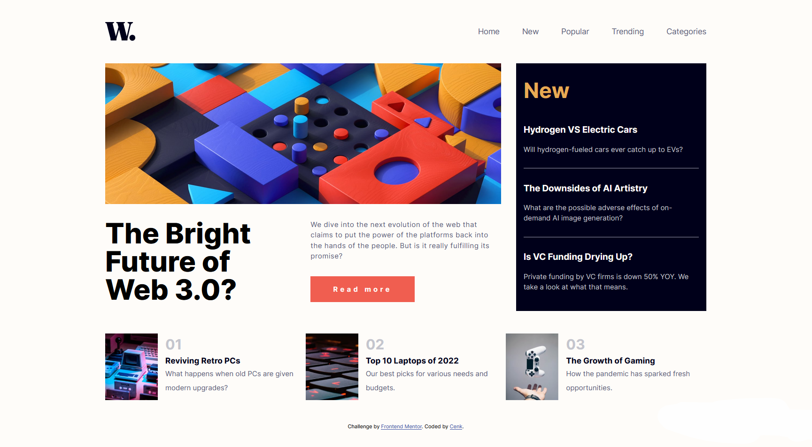
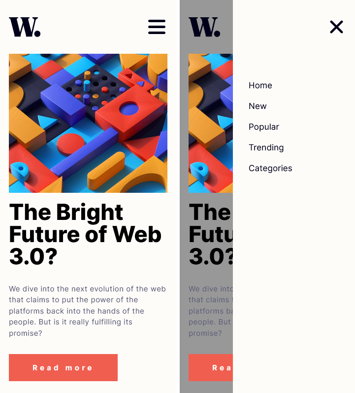

# Frontend Mentor - News homepage solution

This is a solution to the [News homepage challenge on Frontend Mentor](https://www.frontendmentor.io/challenges/news-homepage-H6SWTa1MFl). Frontend Mentor challenges help you improve your coding skills by building realistic projects. 

## Table of contents

- [Overview](#overview)
  - [The challenge](#the-challenge)
  - [Screenshot](#screenshot)
  - [Links](#links)
- [My process](#my-process)
  - [Built with](#built-with)
  - [What I learned](#what-i-learned)
  - [Continued development](#continued-development)
  - [Useful resources](#useful-resources)
- [Author](#author)

## Overview

### The challenge

Users should be able to:

- View the optimal layout for the interface depending on their device's screen size
- See hover and focus states for all interactive elements on the page
- **Bonus**: Toggle the mobile menu (requires some JavaScript)

### Screenshot
Desktop layout

Mobile layout



### Links

- Solution URL: [https://github.com/cenkderman/News-homepage-](https://github.com/cenkderman/News-homepage)
- Live Site URL: [https://cenkderman.github.io/News-homepage-/](https://cenkderman.github.io/News-homepage/)

## My process

### Built with

- Semantic HTML5 markup
- CSS custom properties
- Data attributes
- JS Dom
- Flexbox
- CSS Grid
- Mobile-first workflow

### What I learned
- I learned to use data attributes.

```html
<button class="button" aria-expanded="false">
```
- I made changes on data attributes using js dom
```js
menuButton.addEventListener('click', () => {
    const buttonActive = menuButton.getAttribute('aria-expanded');
    if (buttonActive === 'false') {
        menuButton.setAttribute('aria-expanded', 'true');
        navList.classList.add('open');
        document.body.style.backgroundColor = "rgba(0,0,0,0.4)";
    } else {
        menuButton.setAttribute('aria-expanded', 'false');
        navList.classList.remove('open');
        document.body.style.backgroundColor = "hsl(36, 100%, 99%)";
    }
})
```
- I created responsive menu icon animation by replacing data attributes with js dom
```css
.button[aria-expanded="true"] .line {
    transition: translate 300ms ease-in, rotate 300ms ease-in, opacity 300ms;
}

.button[aria-expanded="true"] .top {
    translate: 0 12px;
    rotate: 45deg;
}

.button[aria-expanded="true"] .bottom {
    translate: 0 -12px;
    rotate: -45deg;
}

.button[aria-expanded="true"] .middle {
    opacity: 0;
}
```

### Continued development
I want to improve myself in css sass and bootstrap and use it in my next projects

### Useful resources

- [CSS-Tricks.com](https://css-tricks.com/a-complete-guide-to-data-attributes/) - A Complete Guide to Data Attributes

## Author
- Frontend Mentor - [@cenkderman](https://www.frontendmentor.io/profile/cenkderman)


